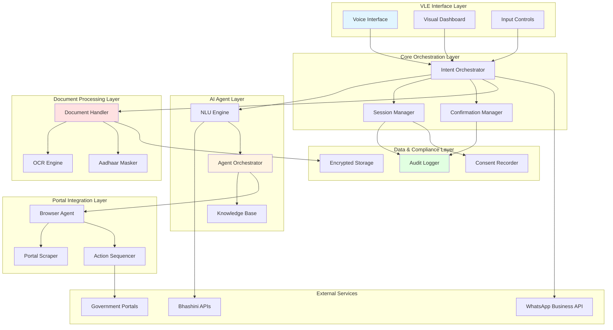
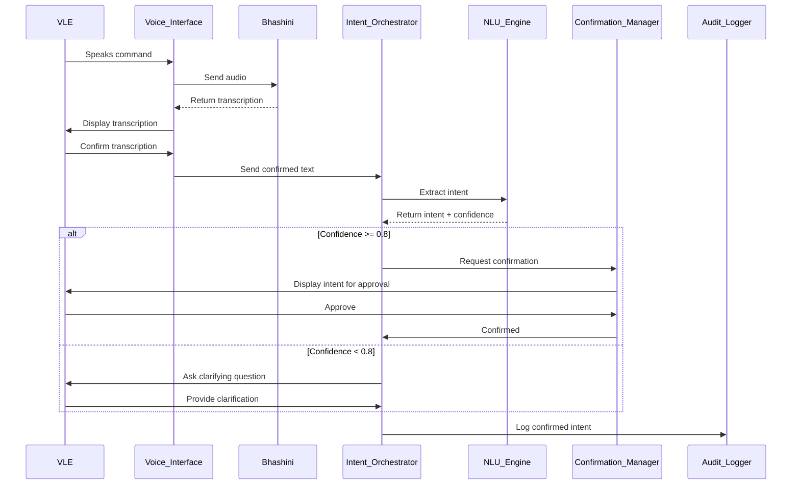
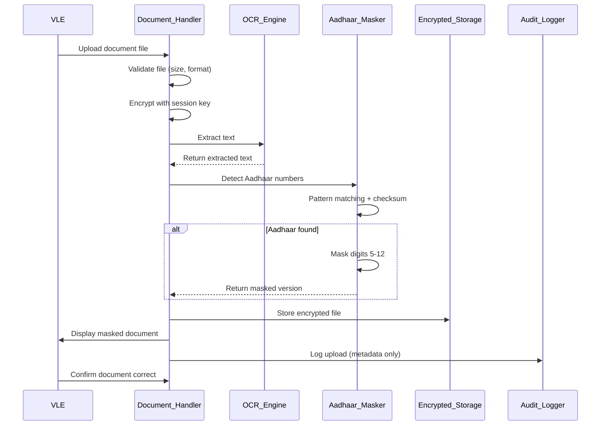
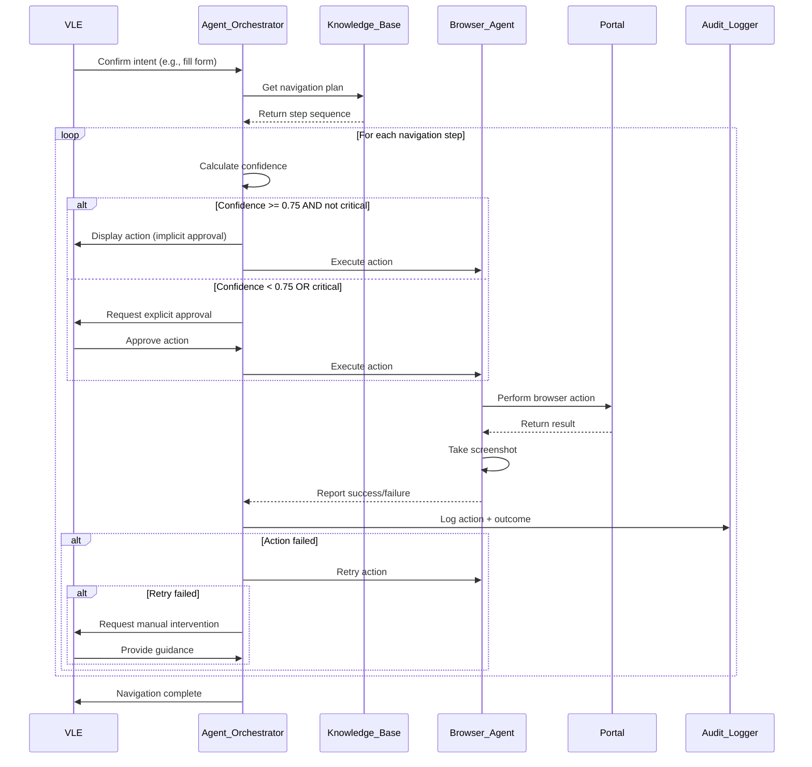
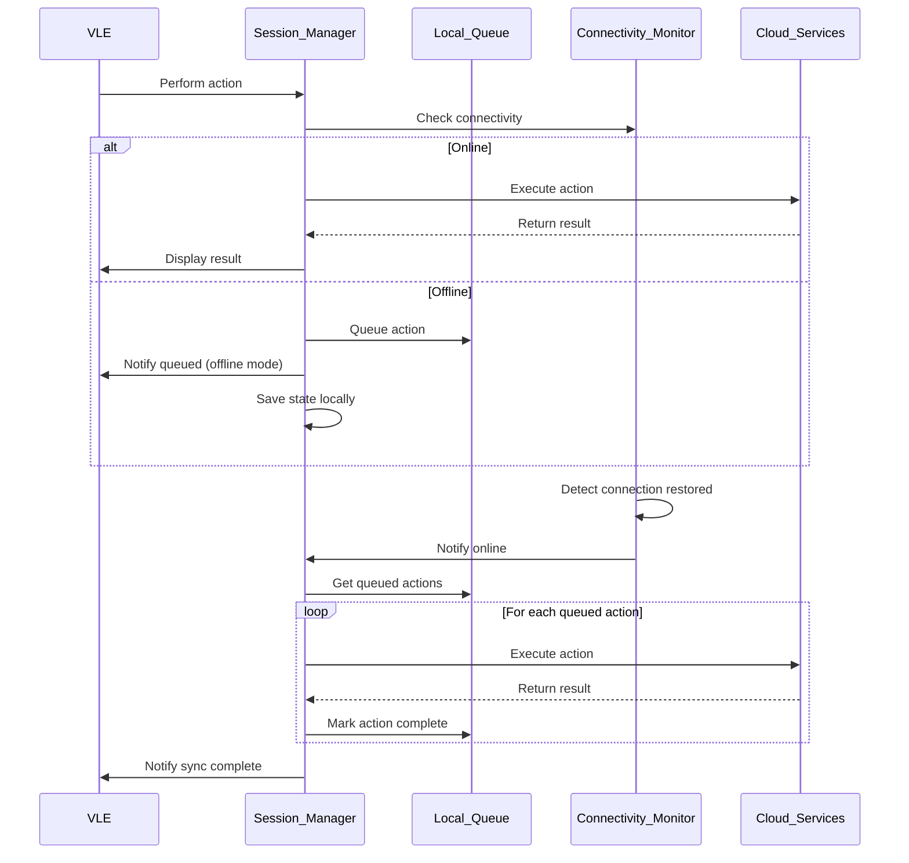

# Design Document: GramSetu

## 1. Overview

GramSetu is a voice-first AI co-pilot system that assists Village Level Entrepreneurs (VLEs) in navigating complex government portals to help rural citizens access government schemes. The system combines multilingual voice interaction, supervised autonomous browser agents, secure document handling, and privacy-by-design principles to operate effectively in rural India's challenging connectivity environment.

The architecture prioritizes human oversight, ensuring VLEs remain in control while AI handles repetitive navigation tasks. The system is designed for DPDP Act 2023 compliance, offline resilience, and Bharat-scale deployment.

### Key Design Principles

1. **Human-Supervised Autonomy**: AI assists but never acts without VLE oversight for critical decisions
2. **Privacy-by-Design**: Aadhaar masking, data minimization, and consent-first approach
3. **Offline-First**: Core functionality continues during connectivity disruptions
4. **Voice-First**: Natural language interaction in regional languages
5. **Fail-Safe**: Graceful degradation rather than complete failure
6. **Audit-Everything**: Comprehensive logging for accountability and compliance
7. **No Security Bypass**: Respect CAPTCHA, OTP, and authentication mechanisms

## 2. Design Justifications

### Why Voice-First?

Rural VLEs often multitask between citizen interaction and portal navigation. Voice interaction allows VLEs to maintain eye contact with citizens, explain processes naturally, and work faster than typing. Regional language support removes the cognitive load of translating between citizen's language and portal language.

### Why Supervised Autonomy?

Fully manual portal navigation is time-consuming and error-prone. Fully autonomous systems risk errors that harm citizens and violate regulations. Supervised autonomy balances efficiency with accountability - the AI handles repetitive tasks while VLEs make critical decisions.

### Why Offline-Tolerant?

Rural internet connectivity is unreliable (2G/3G with frequent dropouts). A system that fails completely during outages is unusable. Offline-tolerant design allows VLEs to continue serving citizens, with automatic sync when connectivity resumes.

### Why Aadhaar Masking?

Aadhaar numbers are sensitive personal data under DPDP Act. Displaying full Aadhaar numbers creates privacy risks and compliance violations. Automatic masking (showing only first 4 and last 4 digits) protects citizens while allowing verification.

### Why No Permanent Storage?

Data minimization is a DPDP Act principle. Storing citizen documents permanently increases breach risk and compliance burden. Temporary storage (session-only) with automatic deletion minimizes risk while enabling service delivery.


## 3. High-Level Architecture



### Architecture Layers Explained

**VLE Interface Layer**: Handles all VLE interactions through voice, visual dashboard, and manual controls. Provides real-time feedback and emergency stop functionality.

**Core Orchestration Layer**: Manages conversation flow, session state, and confirmation loops. Ensures VLE approval before critical actions.

**AI Agent Layer**: Processes natural language, orchestrates autonomous actions, and maintains knowledge of schemes and portals.

**Document Processing Layer**: Handles secure document upload, OCR extraction, Aadhaar detection and masking, and temporary encrypted storage.

**Portal Integration Layer**: Executes browser automation, scrapes portal structure, and sequences navigation actions under supervision.

**External Services**: Integrates with Bhashini for multilingual AI, WhatsApp for notifications, and government portals for applications.

**Data & Compliance Layer**: Provides immutable audit logging, consent management, and encrypted storage for compliance.

## 4. Component-wise Deep Dive

### 4.1 Voice Interface

**Purpose**: Enable natural voice interaction in regional languages with real-time feedback.

**Technology Stack**:
- Bhashini ASR (Automatic Speech Recognition) for speech-to-text
- Bhashini TTS (Text-to-Speech) for speech synthesis
- Bhashini NMT (Neural Machine Translation) for language translation
- WebRTC for audio capture with noise cancellation

**Key Features**:
- Automatic language detection from 11 supported languages
- Confidence scoring for recognition quality
- Background noise filtering (adaptive threshold)
- Fallback to text input when voice quality is poor
- Real-time transcription display for VLE verification

**Data Flow**:
1. VLE speaks command → Audio captured via microphone
2. Audio sent to Bhashini ASR → Text transcription returned
3. Transcription displayed to VLE for verification
4. Confirmed text sent to Intent Orchestrator
5. System response synthesized via Bhashini TTS
6. Audio played to VLE

**Offline Behavior**:
- When Bhashini unavailable: Fall back to text-only mode
- Cache common phrases for offline playback
- Queue voice commands for processing when connectivity resumes

**Error Handling**:
- Low confidence (<0.7): Request VLE to repeat
- High noise: Prompt VLE to reduce background noise
- API timeout: Switch to text input mode
- Language detection failure: Prompt VLE to select language manually

### 4.2 Intent Orchestrator

**Purpose**: Coordinate conversation flow, extract intent from VLE input, and manage confirmation loops.

**Core Responsibilities**:
- Parse VLE commands and extract structured intent
- Maintain conversation context across multi-turn interactions
- Implement confirmation loops for critical actions
- Route intents to appropriate handlers (Agent, Document, Knowledge Base)
- Manage session state and recovery

**Intent Types**:
- `START_APPLICATION`: Begin new scheme application
- `FILL_FIELD`: Populate specific form field
- `UPLOAD_DOCUMENT`: Upload citizen document
- `CHECK_STATUS`: Query application status
- `SUBMIT_APPLICATION`: Final submission
- `NAVIGATE_TO`: Go to specific portal section
- `QUERY_SCHEME`: Ask about scheme eligibility
- `CORRECT_ERROR`: Fix previous input

**Confirmation Strategy**:
- **Low-Risk Actions** (navigate, query): Implicit confirmation via display
- **Medium-Risk Actions** (fill field, upload): Explicit verbal/visual confirmation
- **High-Risk Actions** (submit, payment): Double confirmation with summary review

**State Management**:
- Session state persisted to encrypted local storage every 30 seconds
- State includes: current intent, portal position, filled fields, uploaded documents
- Recovery: On crash/restart, offer VLE option to resume last session

### 4.3 NLU Engine (Natural Language Understanding)

**Purpose**: Extract structured intent and entities from VLE's natural language input.

**Approach**: Hybrid model combining rule-based and ML-based understanding

**Rule-Based Component**:
- Pattern matching for common commands ("start application for PM-KISAN")
- Keyword extraction for scheme names, field names, actions
- Fast, deterministic, works offline

**ML-Based Component**:
- Fine-tuned multilingual BERT model for intent classification
- Named Entity Recognition (NER) for extracting citizen details
- Confidence scoring for ambiguous inputs
- Requires connectivity to cloud inference endpoint

**Training Data**:
- Synthetic data generated from scheme documentation
- Real VLE interactions (anonymized) collected during pilot
- Augmented with paraphrases and regional language variations

**Confidence Thresholds**:
- >0.8: High confidence, proceed with confirmation
- 0.6-0.8: Medium confidence, ask clarifying question
- <0.6: Low confidence, request rephrase or offer options

**Fallback Strategy**:
- If ML model unavailable: Use rule-based only
- If both fail: Present VLE with menu of common intents

### 4.4 Agent Orchestrator

**Purpose**: Execute supervised autonomous portal navigation with human-in-the-loop controls.

**Architecture**: Hierarchical task planning with real-time VLE oversight

**Components**:
- **Task Planner**: Breaks down high-level intent into navigation steps
- **Action Executor**: Performs browser actions (click, type, scroll)
- **State Observer**: Monitors portal state and detects changes
- **Confidence Evaluator**: Assesses certainty before each action
- **Pause Controller**: Halts for VLE approval at checkpoints

**Navigation Strategy**:
1. Retrieve portal navigation plan from Knowledge Base
2. Decompose plan into atomic actions (click button X, fill field Y)
3. For each action:
   - Display action description to VLE
   - If confidence >0.75 and not critical: Execute with implicit approval
   - If confidence <0.75 or critical: Wait for explicit VLE approval
   - Execute action via Browser Agent
   - Observe result and verify expected state reached
   - Log action and outcome to Audit Log
4. On error: Retry once, then request VLE intervention

**Critical Checkpoints** (Always require VLE approval):
- CAPTCHA solving
- OTP entry
- Document upload
- Final form submission
- Payment initiation
- Scheme selection

**Confidence Scoring**:
- Based on: Portal element visibility, element stability, historical success rate
- Adjusted dynamically based on portal changes
- Conservative threshold (0.75) to minimize errors

**Failure Handling**:
- **Element Not Found**: Retry after 2 seconds, then notify VLE
- **Unexpected Portal State**: Pause and request VLE guidance
- **Timeout**: Mark action as failed, offer manual control
- **Portal Structure Changed**: Flag for Knowledge Base update, request manual navigation

### 4.5 Document Handler

**Purpose**: Securely process citizen documents with automatic Aadhaar masking and OCR extraction.

**Processing Pipeline**:
1. **Upload**: VLE selects document file (PDF/JPEG/PNG)
2. **Validation**: Check file size (<10MB), format, and integrity
3. **Encryption**: Encrypt file with AES-256 using session key
4. **OCR**: Extract text using Tesseract OCR engine
5. **Aadhaar Detection**: Regex pattern matching for 12-digit Aadhaar
6. **Masking**: Replace digits 5-12 with 'X' (e.g., 1234-XXXX-XX89)
7. **Storage**: Store encrypted file in temporary session storage
8. **Display**: Show masked version to VLE for verification
9. **Cleanup**: Delete all files within 5 minutes of session end

**Aadhaar Detection Patterns**:
- 12 consecutive digits: `\d{12}`
- Formatted with spaces: `\d{4}\s\d{4}\s\d{4}`
- Formatted with hyphens: `\d{4}-\d{4}-\d{4}`
- Embedded in text: Extract and validate using Verhoeff checksum

**OCR Configuration**:
- Language: English + Hindi (Devanagari script)
- Preprocessing: Deskew, denoise, contrast enhancement
- Confidence threshold: 0.8 for field auto-fill suggestions

**Security Measures**:
- Files never stored unencrypted
- Session keys rotated per session
- Memory cleared after processing
- No logging of document contents
- Encrypted files deleted on session end (5-minute grace period)

**Offline Behavior**:
- Documents uploaded offline stored in encrypted local queue
- Automatic upload when connectivity resumes
- VLE notified of pending uploads

### 4.6 Browser Agent

**Purpose**: Execute browser automation for portal navigation using headless browser.

**Technology**: Playwright (supports Chromium, Firefox, WebKit)

**Capabilities**:
- Navigate to URLs
- Click elements (buttons, links, checkboxes)
- Fill text fields
- Select dropdowns
- Upload files
- Handle alerts and popups
- Take screenshots for audit trail
- Execute JavaScript for complex interactions

**Element Selection Strategy**:
- Priority 1: Stable IDs (`id="submit-button"`)
- Priority 2: ARIA labels (`aria-label="Submit"`)
- Priority 3: Semantic selectors (`button[type="submit"]`)
- Priority 4: XPath with text matching
- Fallback: Visual element detection using computer vision

**Resilience Features**:
- Wait for element visibility before interaction
- Retry with exponential backoff on transient failures
- Handle dynamic content loading (AJAX)
- Detect and handle session timeouts
- Screenshot capture before/after critical actions

**Security Considerations**:
- Browser runs in sandboxed environment
- No browser extensions or plugins
- Cookies isolated per VLE session
- Automatic cookie clearing on session end
- No credential storage in browser

### 4.7 Knowledge Base

**Purpose**: Maintain up-to-date information on schemes, portals, and navigation procedures.

**Content Structure**:
```
Schemes:
  - Scheme ID
  - Name (multilingual)
  - Eligibility criteria
  - Required documents
  - Portal URL
  - Navigation steps
  - Common errors and solutions

Portals:
  - Portal ID
  - URL
  - Authentication method
  - Element selectors (versioned)
  - Known issues
  - Last verified date

Navigation Plans:
  - Intent type
  - Portal ID
  - Step sequence
  - Confidence scores
  - Success rate
```

**Update Mechanism**:
- **Automated**: Daily scraping of scheme websites for changes
- **Manual**: Admin interface for adding new schemes/portals
- **Crowdsourced**: VLE feedback on navigation failures triggers review
- **Versioning**: Track changes to portal structure over time

**Storage**: PostgreSQL database with full-text search and versioning

**Caching**: Frequently accessed schemes cached locally for offline access

### 4.8 Session Manager

**Purpose**: Manage VLE sessions, maintain state, and enable recovery.

**Session Lifecycle**:
1. **Start**: VLE authenticates → Session created with unique ID
2. **Active**: State updated on every action
3. **Persist**: State saved to encrypted storage every 30 seconds
4. **End**: VLE logs out or timeout (30 minutes inactivity)
5. **Cleanup**: Documents deleted, logs finalized, session archived

**Session State**:
- VLE ID and authentication token
- Current citizen (name, consent status)
- Active intent and conversation context
- Portal navigation position
- Uploaded documents (encrypted references)
- Filled form fields
- Pending actions queue (for offline)

**Recovery Scenarios**:
- **Browser crash**: Reload from last persisted state
- **Network interruption**: Continue offline, sync on reconnection
- **System restart**: Offer VLE option to resume incomplete sessions

**Timeout Handling**:
- Warning at 25 minutes of inactivity
- Auto-save and logout at 30 minutes
- Session state retained for 24 hours for recovery

### 4.9 Audit Logger

**Purpose**: Provide immutable, comprehensive audit trail for accountability and compliance.

**Logged Events**:
- VLE authentication and logout
- Voice commands and transcriptions
- Intent extraction and confirmations
- Portal navigation actions
- Document uploads (metadata only, not contents)
- VLE approvals and rejections
- System errors and warnings
- Consent capture and withdrawal

**Log Entry Structure**:
```json
{
  "log_id": "uuid",
  "timestamp": "ISO8601",
  "session_id": "uuid",
  "vle_id": "hashed",
  "event_type": "INTENT_CONFIRMED",
  "event_data": {
    "intent": "START_APPLICATION",
    "scheme": "PM-KISAN",
    "confidence": 0.92
  },
  "signature": "cryptographic_signature"
}
```

**Security**:
- Logs cryptographically signed to prevent tampering
- Sequential IDs to detect missing entries
- Append-only storage (no updates or deletes)
- Sensitive data (Aadhaar, documents) excluded
- Access restricted to authorized auditors

**Storage**: Time-series database (InfluxDB) for efficient querying and retention

**Retention**: 7 years as per compliance requirements

### 4.10 Consent Recorder

**Purpose**: Capture, store, and manage citizen consent for DPDP Act compliance.

**Consent Capture Flow**:
1. VLE starts new citizen session
2. System prompts VLE to obtain citizen consent
3. VLE reads consent statement to citizen (in citizen's language)
4. Citizen provides verbal consent
5. VLE confirms consent in system
6. System records: Citizen name, purpose, data categories, timestamp
7. Consent record cryptographically signed and stored

**Consent Statement Template**:
```
"I, [Citizen Name], consent to [VLE Name] at [CSC Location] collecting and processing my personal data including [data categories] for the purpose of [specific purpose] through the GramSetu system. I understand my data will be used only for this purpose and deleted within [retention period]. I can withdraw consent at any time."
```

**Data Categories**:
- Basic identity (name, age, address)
- Aadhaar number (masked)
- Documents (type and purpose)
- Scheme application details

**Consent Withdrawal**:
- VLE can mark consent as withdrawn
- System immediately stops processing
- Data deletion initiated within 24 hours
- Audit log records withdrawal

**Storage**: Encrypted PostgreSQL table with tamper-proof signatures

**Access**: Available to VLE, citizen (via VLE), and authorized auditors


## 5. Data Flow Diagrams

### 5.1 Voice Command Processing Flow



### 5.2 Document Upload and Masking Flow



### 5.3 Supervised Portal Navigation Flow



### 5.4 Offline Operation and Sync Flow



## 6. Agentic AI Design

### 6.1 Supervised Autonomy Model

GramSetu implements a **Level 2 Autonomy** model (on a scale of 0-5):
- **Level 0**: No automation (manual only)
- **Level 1**: Assistance (suggestions only)
- **Level 2**: Partial automation with human oversight ← GramSetu
- **Level 3**: Conditional automation (human on standby)
- **Level 4**: High automation (human optional)
- **Level 5**: Full automation (no human)

**Why Level 2?**
- Balances efficiency with accountability
- VLE maintains legal responsibility
- Reduces errors from full automation
- Builds VLE trust through transparency
- Complies with government oversight requirements

### 6.2 Confidence-Based Decision Making

The Agent Orchestrator uses confidence scores to determine autonomy level:

| Confidence Range | Action Type | Autonomy Level |
|-----------------|-------------|----------------|
| 0.90 - 1.00 | Non-critical navigation | Execute with implicit approval (display only) |
| 0.75 - 0.89 | Standard form filling | Execute with explicit approval |
| 0.60 - 0.74 | Ambiguous actions | Request clarification first |
| 0.00 - 0.59 | Uncertain actions | Offer options or request manual control |

**Critical Actions** (always require explicit approval regardless of confidence):
- CAPTCHA solving
- OTP entry
- Document upload
- Final submission
- Payment initiation
- Scheme selection

### 6.3 Failure Handling Strategy

**Failure Categories**:

1. **Transient Failures** (network timeout, element loading delay)
   - Strategy: Automatic retry with exponential backoff
   - Max retries: 2
   - Escalation: Request VLE intervention after retries exhausted

2. **Ambiguous State** (unexpected portal response, unclear next step)
   - Strategy: Pause and display current state to VLE
   - Options: Provide suggested actions or manual control
   - Learning: Log for Knowledge Base update

3. **Critical Failures** (portal crash, authentication failure)
   - Strategy: Immediate halt and save session state
   - Notification: Alert VLE with error details
   - Recovery: Offer session resume after issue resolution

4. **Confidence Degradation** (repeated low-confidence actions)
   - Strategy: Switch to manual mode with AI suggestions
   - Notification: Inform VLE that portal may have changed
   - Escalation: Flag for Knowledge Base review

**Failure Recovery**:
- All failures logged with context for debugging
- Session state preserved for recovery
- VLE always offered manual control option
- Failed actions never retried without VLE awareness

### 6.4 Learning and Adaptation

**Short-Term Learning** (within session):
- Track success/failure rates of actions
- Adjust confidence scores based on outcomes
- Adapt to VLE preferences (e.g., approval speed)

**Long-Term Learning** (across sessions):
- Aggregate navigation success rates per portal
- Identify portal changes through failure patterns
- Update Knowledge Base with successful workarounds
- Improve NLU model with anonymized VLE interactions

**Human-in-the-Loop Learning**:
- VLE corrections used to improve intent recognition
- Manual interventions analyzed to identify automation gaps
- VLE feedback on suggestions improves ranking

**Limitations**:
- No learning from citizen data (privacy protection)
- No cross-VLE data sharing without anonymization
- No automatic portal modification (read-only interaction)

## 7. Privacy & Trust Architecture

### 7.1 Aadhaar Masking Implementation

**Detection Algorithm**:
```
1. Extract all 12-digit sequences from document text
2. For each sequence:
   a. Check if digits are consecutive (not phone number pattern)
   b. Validate using Verhoeff checksum algorithm
   c. If valid, mark as Aadhaar number
3. For each detected Aadhaar:
   a. Extract first 4 digits
   b. Extract last 4 digits
   c. Replace middle 8 digits with 'XXXX-XXXX'
   d. Format as: NNNN-XXXX-XXNN
```

**Masking Enforcement**:
- All document displays show masked version only
- Original Aadhaar never logged or stored unencrypted
- OCR output sanitized before any processing
- API responses filtered to remove full Aadhaar
- Screenshots automatically blur Aadhaar regions

**Verification Without Exposure**:
- VLE verifies first 4 and last 4 digits with citizen
- Portal submission uses full Aadhaar (encrypted in transit)
- Full Aadhaar never displayed on screen

### 7.2 Consent Capture Mechanism

**Consent Flow**:
1. VLE starts new citizen session
2. System generates consent statement in citizen's language
3. VLE reads statement to citizen (or citizen reads on screen)
4. System captures:
   - Citizen name
   - Purpose of data collection
   - Data categories being collected
   - Retention period
   - VLE ID and CSC location
   - Timestamp
5. VLE confirms citizen provided verbal consent
6. System creates tamper-proof consent record

**Consent Record Structure**:
```json
{
  "consent_id": "uuid",
  "timestamp": "ISO8601",
  "citizen_name": "encrypted",
  "vle_id": "hashed",
  "csc_location": "encrypted",
  "purpose": "Application for PM-KISAN scheme",
  "data_categories": ["name", "address", "aadhaar_masked", "bank_details"],
  "retention_days": 90,
  "language": "hindi",
  "status": "active",
  "signature": "cryptographic_signature"
}
```

**Consent Withdrawal**:
- VLE can mark consent as withdrawn at any time
- System immediately stops all processing
- Data deletion job triggered (completes within 24 hours)
- Audit log records withdrawal with timestamp
- Consent record updated to "withdrawn" status

### 7.3 Audit Logging for Accountability

**Comprehensive Logging**:
- Every system action logged with timestamp and actor
- Logs include: who, what, when, why, and outcome
- Immutable append-only log structure
- Cryptographic signatures prevent tampering

**Log Categories**:
- **Authentication**: VLE login/logout, session creation
- **Voice Interaction**: Commands, transcriptions, intent extraction
- **Portal Navigation**: Every click, form fill, submission
- **Document Handling**: Upload, OCR, masking (metadata only)
- **Consent**: Capture, withdrawal, access requests
- **Errors**: Failures, retries, manual interventions
- **System Events**: Startup, shutdown, configuration changes

**Privacy Protection in Logs**:
- No full Aadhaar numbers logged
- No document contents logged
- Citizen names encrypted
- VLE IDs hashed
- Sensitive fields redacted

**Audit Access**:
- VLEs: Can view their own session logs
- Administrators: Can view system-wide logs (with redaction)
- Auditors: Can access full logs with proper authorization
- Citizens: Can request their data logs via VLE

### 7.4 Data Minimization Strategy

**Collection Minimization**:
- Collect only data necessary for specific scheme application
- No speculative data collection for future use
- Prompt VLE if unnecessary data being entered

**Storage Minimization**:
- Documents stored only during active session
- Automatic deletion within 5 minutes of session end
- No permanent storage of citizen documents
- Consent records retained only as legally required (3 years)
- Audit logs retained only as required (7 years)

**Processing Minimization**:
- Data processed only for stated purpose
- No analytics on citizen data without anonymization
- No cross-citizen data correlation
- No data sharing with third parties

**Retention Policy**:
| Data Type | Retention Period | Justification |
|-----------|------------------|---------------|
| Documents | Session only (max 5 min after end) | No legal requirement |
| Consent Records | 3 years | DPDP Act requirement |
| Audit Logs | 7 years | Compliance and legal |
| Session State | 24 hours | Recovery support |
| Analytics (anonymized) | Indefinite | System improvement |

### 7.5 Encryption and Security

**Data at Rest**:
- All documents encrypted with AES-256
- Session keys rotated per session
- Database encryption for consent and audit logs
- Encrypted backups with separate key management

**Data in Transit**:
- TLS 1.3 for all network communication
- Certificate pinning for critical services
- End-to-end encryption for WhatsApp notifications
- Bhashini API calls over HTTPS

**Key Management**:
- Hardware Security Module (HSM) for master keys
- Session keys derived from master key + session ID
- Key rotation every 90 days
- Separate keys for different data categories

**Access Control**:
- Role-based access control (RBAC)
- VLEs: Access only their own sessions
- Administrators: System management, no citizen data access
- Auditors: Read-only access to logs with authorization
- Multi-factor authentication for all users

## 8. Offline & Resilience Strategy

### 8.1 Offline Capabilities

**Fully Offline**:
- Voice command capture (stored locally)
- Document upload and encryption
- Session state management
- Basic intent recognition (rule-based)
- Knowledge Base queries (cached schemes)

**Requires Connectivity**:
- Bhashini ASR/TTS (voice processing)
- ML-based intent recognition
- Portal navigation
- WhatsApp notifications
- Knowledge Base updates

**Hybrid Mode** (intermittent connectivity):
- Queue actions during offline periods
- Automatic sync when connectivity resumes
- Prioritize critical actions (submissions)
- Notify VLE of sync status

### 8.2 Offline Queue Management

**Queue Structure**:
```json
{
  "queue_id": "uuid",
  "session_id": "uuid",
  "action_type": "UPLOAD_DOCUMENT",
  "action_data": "encrypted_payload",
  "priority": 2,
  "created_at": "ISO8601",
  "retry_count": 0,
  "status": "pending"
}
```

**Priority Levels**:
1. **Critical**: Final submissions, payment confirmations
2. **High**: Document uploads, status checks
3. **Medium**: Form field updates, navigation actions
4. **Low**: Analytics, non-essential logs

**Sync Strategy**:
- Process queue in priority order
- Retry failed actions with exponential backoff
- Notify VLE of sync progress
- Allow VLE to cancel queued actions

### 8.3 Graceful Degradation

**Connectivity Loss Scenarios**:

| Scenario | System Behavior |
|----------|-----------------|
| Bhashini unavailable | Fall back to text input, disable voice |
| Portal unreachable | Queue navigation actions, notify VLE |
| WhatsApp API down | Queue notifications, retry later |
| Knowledge Base unreachable | Use cached data, disable updates |
| Complete offline | Voice capture, document handling, queue all else |

**User Experience**:
- Clear visual indicators of offline status
- Estimated sync time when connectivity resumes
- Option to continue offline or wait for connectivity
- No data loss during transitions

### 8.4 Resilience Patterns

**Circuit Breaker**:
- Detect repeated failures to external service
- Open circuit after 5 consecutive failures
- Attempt reconnection after 60 seconds
- Notify VLE of service unavailability

**Retry with Backoff**:
- First retry: 1 second delay
- Second retry: 2 seconds delay
- Third retry: 4 seconds delay
- Max retries: 3
- Escalate to VLE after exhaustion

**Timeout Configuration**:
- Voice API: 5 seconds
- Portal navigation: 30 seconds per action
- Document upload: 60 seconds
- Knowledge Base query: 2 seconds

**Health Monitoring**:
- Periodic health checks for all external services
- Proactive notification of degraded services
- Automatic fallback to degraded mode
- Recovery detection and mode restoration


## 9. Security Design

### 9.1 Threat Model

**Threat Actors**:
1. **Malicious VLE**: Attempts to access/misuse citizen data
2. **External Attacker**: Attempts to breach system remotely
3. **Insider Threat**: Administrator with elevated access
4. **Physical Access**: Unauthorized access to CSC computers
5. **Network Attacker**: Man-in-the-middle, eavesdropping

**Assets to Protect**:
- Citizen personal data (Aadhaar, documents, application details)
- VLE credentials and session tokens
- Audit logs and consent records
- System configuration and keys
- Portal access credentials

**Attack Vectors**:
- Credential theft (phishing, keylogging)
- Data exfiltration (unauthorized copying)
- Session hijacking
- Audit log tampering
- Denial of service
- Social engineering

### 9.2 Security Controls

**Authentication**:
- Multi-factor authentication for VLEs (password + OTP)
- Session tokens with 30-minute timeout
- Automatic logout on inactivity
- Failed login attempt limiting (5 attempts → 15-minute lockout)

**Authorization**:
- Role-based access control (VLE, Admin, Auditor)
- Principle of least privilege
- VLEs access only their own sessions
- Admins cannot access citizen data
- Auditors have read-only access with logging

**Data Protection**:
- AES-256 encryption for data at rest
- TLS 1.3 for data in transit
- Automatic Aadhaar masking
- Secure key management (HSM)
- Memory clearing after sensitive operations

**Audit and Monitoring**:
- Comprehensive logging of all actions
- Real-time anomaly detection
- Alert on suspicious patterns (bulk downloads, unusual access times)
- Tamper-proof audit logs
- Regular security audits

**Physical Security**:
- Screen privacy filters recommended for CSCs
- Automatic screen lock after 5 minutes
- No data persistence on local disk (except encrypted queue)
- Secure boot and disk encryption on CSC computers

### 9.3 Compliance Controls

**DPDP Act, 2023**:
- Consent capture before data collection
- Purpose limitation enforcement
- Data minimization by design
- Right to access (citizen can request data)
- Right to erasure (consent withdrawal)
- Data breach notification (within 72 hours)
- Data localization (all data in India)

**Aadhaar Act, 2016**:
- Aadhaar used only with consent
- Aadhaar masked in all displays
- No permanent Aadhaar storage
- Aadhaar transmission encrypted
- Compliance with UIDAI regulations

**IT Act, 2000**:
- Reasonable security practices
- Sensitive personal data protection
- Incident response procedures
- Data breach notification
- Audit trail maintenance

### 9.4 Incident Response

**Detection**:
- Automated anomaly detection
- VLE reporting mechanism
- System health monitoring
- Security log analysis

**Response Procedure**:
1. **Identify**: Confirm security incident
2. **Contain**: Isolate affected systems
3. **Eradicate**: Remove threat
4. **Recover**: Restore normal operations
5. **Learn**: Post-incident analysis

**Notification**:
- CERT-In notification within 6 hours (critical incidents)
- Affected citizens notified within 72 hours
- Regulatory bodies notified as required
- Public disclosure if widespread impact

## 10. Deployment & Scalability Approach

### 10.1 Deployment Architecture

**Cloud Infrastructure** (AWS/Azure/GCP in India regions):
- **Compute**: Kubernetes cluster for microservices
- **Storage**: S3-compatible object storage for encrypted documents
- **Database**: PostgreSQL (RDS) for structured data, InfluxDB for logs
- **Cache**: Redis for session state and Knowledge Base cache
- **Queue**: RabbitMQ for offline action queue
- **CDN**: CloudFront for static assets and Knowledge Base content

**Edge Deployment** (CSC locations):
- Lightweight client application (Electron-based)
- Local encrypted storage for offline queue
- Automatic updates via secure channel
- Minimal hardware requirements (4GB RAM, dual-core CPU)

**Hybrid Architecture**:
- Core AI services in cloud (Bhashini, NLU, Agent Orchestrator)
- Session management distributed (cloud + edge)
- Document processing at edge (privacy)
- Audit logging in cloud (durability)

### 10.2 Scalability Strategy

**Horizontal Scaling**:
- Stateless microservices scale independently
- Load balancing across multiple instances
- Auto-scaling based on VLE concurrency
- Database read replicas for query scaling

**Vertical Scaling**:
- NLU inference on GPU instances
- OCR processing on high-memory instances
- Database vertical scaling for write throughput

**Capacity Planning**:
- **Phase 1** (Pilot): 1,000 VLEs, 10,000 citizens/day
- **Phase 2** (Regional): 50,000 VLEs, 500,000 citizens/day
- **Phase 3** (National): 500,000 VLEs, 5 million citizens/day

**Performance Targets**:
- Voice response latency: <3 seconds (p95)
- Portal action execution: <2 seconds (p95)
- Document processing: <5 seconds (p95)
- System uptime: 99.5%

### 10.3 Monitoring and Observability

**Metrics**:
- VLE concurrency and session duration
- Voice command latency and accuracy
- Portal navigation success rate
- Document processing throughput
- Error rates by component
- Offline queue depth and sync time

**Logging**:
- Structured logs (JSON format)
- Centralized log aggregation (ELK stack)
- Log levels: DEBUG, INFO, WARN, ERROR, CRITICAL
- Correlation IDs for request tracing

**Alerting**:
- High error rate (>5% in 5 minutes)
- Service unavailability (>1 minute)
- Offline queue backlog (>1000 items)
- Security anomalies (unusual access patterns)
- Performance degradation (latency >2x baseline)

**Dashboards**:
- Real-time VLE activity map
- System health overview
- Performance metrics
- Error trends
- Capacity utilization

### 10.4 Continuous Improvement

**A/B Testing**:
- Test NLU model improvements
- Evaluate UI/UX changes
- Compare navigation strategies
- Measure impact on VLE efficiency

**Feedback Loops**:
- VLE feedback collection (in-app surveys)
- Citizen satisfaction tracking (via VLE)
- Error pattern analysis
- Portal change detection

**Knowledge Base Updates**:
- Weekly scheme information refresh
- Daily portal structure validation
- Crowdsourced navigation improvements
- Automated change detection

## 11. Correctness Properties

*A property is a characteristic or behavior that should hold true across all valid executions of a system—essentially, a formal statement about what the system should do. Properties serve as the bridge between human-readable specifications and machine-verifiable correctness guarantees.*

Before defining properties, let me analyze the acceptance criteria for testability:


### Property Reflection

After analyzing all acceptance criteria, I've identified the following consolidation opportunities:

**Redundancy Analysis**:

1. **Logging Properties**: Requirements 3.4, 5.9, and 9.1 all test that actions are logged. These can be consolidated into a single comprehensive logging property.

2. **Approval Properties**: Requirements 5.3, 6.1, and 5.6 all test approval flows. These can be combined into a property about critical actions requiring approval.

3. **Language Consistency**: Requirements 1.4, 2.4, and 10.3 all test language preference preservation. These can be consolidated.

4. **Aadhaar Privacy**: Requirements 4.2 and 4.8 both test Aadhaar masking. Property 4.8 (never display full Aadhaar) subsumes 4.2 (masking format).

5. **Offline Resilience**: Requirements 7.2 and 7.3 test offline queueing and sync. These form a natural round-trip property.

6. **Document Lifecycle**: Requirements 4.3, 4.4, and 4.5 all relate to document storage and cleanup. These can be combined into a comprehensive document lifecycle property.

7. **Consent Completeness**: Requirement 8.2 tests consent record fields, which is subsumed by the broader consent capture property in 8.1.

8. **Error Display**: Requirement 12.1 is a specific case of the broader multilingual support tested in other properties.

**Consolidated Property Set**: After reflection, we'll focus on unique, high-value properties that provide comprehensive coverage without redundancy.

### Correctness Properties

#### Property 1: Voice Command Processing Latency
*For any* voice command in a supported language under normal network conditions, the Voice_Interface SHALL convert speech to text within 3 seconds.
**Validates: Requirements 1.1**

#### Property 2: Language Detection Accuracy
*For any* audio input in a supported language (Hindi, English, Tamil, Telugu, Marathi, Bengali, Gujarati, Kannada, Malayalam, Punjabi, Odia), the Voice_Interface SHALL correctly identify the language.
**Validates: Requirements 1.2**

#### Property 3: Language Consistency Across Interaction
*For any* VLE session, when the VLE uses language L for input, all system responses (voice synthesis, notifications, error messages) SHALL be in language L.
**Validates: Requirements 1.4, 2.4, 10.3, 12.1**

#### Property 4: Text-Voice Input Equivalence
*For any* command C, submitting C as text SHALL produce the same intent extraction result as submitting C as voice (after transcription).
**Validates: Requirements 1.5**

#### Property 5: Language Switching Adaptation
*For any* two supported languages L1 and L2, when a VLE switches from L1 to L2 mid-session, all subsequent interactions SHALL be in L2.
**Validates: Requirements 2.2**

#### Property 6: Intent Confirmation Loop
*For any* VLE command, the system SHALL extract an intent and present it to the VLE for confirmation before proceeding with execution.
**Validates: Requirements 3.1**

#### Property 7: Ambiguous Intent Handling
*For any* command with multiple possible intents, the system SHALL present all options to the VLE and wait for explicit selection.
**Validates: Requirements 3.3**

#### Property 8: Intent Rejection Recovery
*For any* rejected intent, the system SHALL prompt the VLE for rephrasing and re-attempt understanding without losing session context.
**Validates: Requirements 3.5**

#### Property 9: Aadhaar Detection Completeness
*For any* document containing one or more Aadhaar numbers (in formats: XXXXXXXXXXXX, XXXX XXXX XXXX, or XXXX-XXXX-XXXX), the Document_Handler SHALL detect all Aadhaar numbers.
**Validates: Requirements 4.1**

#### Property 10: Aadhaar Display Privacy
*For any* document processed by the system, no full Aadhaar number SHALL ever be displayed to the VLE—only masked versions (NNNN-XXXX-XXNN) SHALL be shown.
**Validates: Requirements 4.2, 4.8**

#### Property 11: Document Encryption at Rest
*For any* document uploaded during a session, the stored file SHALL be encrypted with AES-256 before being written to storage.
**Validates: Requirements 4.3**

#### Property 12: Document Lifecycle and Cleanup
*For any* session, all uploaded documents SHALL be deleted within 5 minutes of session end, and failed uploads SHALL be queued locally for retry when connectivity resumes.
**Validates: Requirements 4.4, 4.5**

#### Property 13: OCR Text Extraction
*For any* document in supported formats (PDF, JPEG, PNG) under 10MB, the Document_Handler SHALL extract text using OCR for form auto-fill suggestions.
**Validates: Requirements 4.7**

#### Property 14: Navigation Action Transparency
*For any* portal navigation action, the Agent_Orchestrator SHALL display the action description to the VLE in real-time before or during execution.
**Validates: Requirements 5.2**

#### Property 15: Critical Action Approval Requirement
*For any* critical action (CAPTCHA, OTP, document upload, final submission, payment, scheme selection), the Agent_Orchestrator SHALL pause and require explicit VLE approval before proceeding.
**Validates: Requirements 5.4, 5.5, 5.6, 6.3**

#### Property 16: Portal Change Detection
*For any* portal navigation, when the portal structure differs from the expected structure in the Knowledge Base, the Agent_Orchestrator SHALL notify the VLE and request manual intervention.
**Validates: Requirements 5.8**

#### Property 17: Comprehensive Audit Logging
*For any* system action (voice command, intent confirmation, document upload, portal navigation, VLE approval, error), an entry SHALL be recorded in the Audit_Log with timestamp, VLE ID, action type, and outcome.
**Validates: Requirements 3.4, 5.9, 9.1**

#### Property 18: Action Approval Loop
*For any* proposed autonomous action, the system SHALL display the action description and wait for VLE approval (explicit or implicit based on confidence and criticality).
**Validates: Requirements 6.1**

#### Property 19: Manual Control Mode
*For any* session, when the VLE takes manual control, all autonomous actions SHALL pause and resume only when the VLE explicitly requests it.
**Validates: Requirements 6.4**

#### Property 20: Emergency Stop Functionality
*For any* active session, activating the Emergency Stop control SHALL immediately halt all autonomous actions and save the current session state for later resumption.
**Validates: Requirements 6.5, 6.6**

#### Property 21: Offline Mode Activation
*For any* session, when internet connectivity is lost, the system SHALL notify the VLE, continue accepting voice input and document uploads, and queue actions that require connectivity.
**Validates: Requirements 7.1, 7.2**

#### Property 22: Offline-Online Round Trip
*For any* action queued while offline, when connectivity resumes, the system SHALL automatically sync the queued action and resume normal operation.
**Validates: Requirements 7.3**

#### Property 23: Service Degradation Fallback
*For any* external service unavailability (Bhashini, portal, WhatsApp), the system SHALL fall back to degraded mode (e.g., text input when voice unavailable) rather than complete failure.
**Validates: Requirements 7.6**

#### Property 24: Consent Capture Requirement
*For any* new citizen session, the system SHALL prompt the VLE to obtain citizen consent before processing any citizen data.
**Validates: Requirements 8.1**

#### Property 25: Consent Record Completeness
*For any* recorded consent, the Consent_Record SHALL include citizen name, purpose, data categories, timestamp, and be stored encrypted with tamper-proof signature.
**Validates: Requirements 8.2, 8.3**

#### Property 26: Consent Withdrawal Processing
*For any* consent withdrawal, the system SHALL immediately stop processing and delete associated data within 24 hours.
**Validates: Requirements 8.4**

#### Property 27: Aadhaar Consent Specificity
*For any* session processing Aadhaar data, the consent record SHALL explicitly mention Aadhaar usage.
**Validates: Requirements 8.7**

#### Property 28: Audit Log Immutability
*For any* audit log entry, the entry SHALL be cryptographically signed and assigned a unique sequential ID to prevent tampering and detect missing entries.
**Validates: Requirements 9.3, 9.4**

#### Property 29: Audit Log Privacy Protection
*For any* audit log entry, the entry SHALL NOT contain sensitive data such as full Aadhaar numbers or document contents.
**Validates: Requirements 9.7**

#### Property 30: Notification Triggering
*For any* successful application submission or status change, the system SHALL send a WhatsApp notification to the citizen's number in their preferred language.
**Validates: Requirements 10.1, 10.2, 10.3**

#### Property 31: Notification Retry Resilience
*For any* failed WhatsApp notification, the system SHALL retry up to 3 times with exponential backoff before marking as failed.
**Validates: Requirements 10.4**

#### Property 32: Notification Content Completeness
*For any* notification message, the message SHALL include application reference number, scheme name, and status.
**Validates: Requirements 10.5**

#### Property 33: Notification Opt-Out Respect
*For any* citizen who has opted out of notifications, the system SHALL NOT send WhatsApp messages to that citizen.
**Validates: Requirements 10.7**

#### Property 34: Scheme Query Language Matching
*For any* VLE query about scheme eligibility, the system SHALL provide criteria in the VLE's chosen language.
**Validates: Requirements 11.2**

#### Property 35: Eligibility Matching Accuracy
*For any* set of citizen details, the system SHALL suggest only schemes where the citizen meets all eligibility criteria.
**Validates: Requirements 11.3**

#### Property 36: Error Retry Behavior
*For any* portal navigation error, the Agent_Orchestrator SHALL attempt automatic retry up to 2 times before requesting VLE intervention.
**Validates: Requirements 12.2**

#### Property 37: Session Recovery Round Trip
*For any* interrupted session, the system SHALL save session state and allow resumption from the last confirmed action.
**Validates: Requirements 12.3**

#### Property 38: Submission Resilience
*For any* form submission, when connectivity errors occur, the system SHALL preserve form data and retry submission when connectivity resumes.
**Validates: Requirements 12.6**


## 12. Error Handling Strategy

### Error Categories

**Transient Errors** (Automatic Retry):
- Network timeouts
- API rate limiting
- Temporary service unavailability
- Portal element loading delays

**User-Actionable Errors** (VLE Intervention):
- Low confidence intent recognition
- Ambiguous commands
- Portal structure changes
- CAPTCHA/OTP requirements
- Form validation failures

**Critical Errors** (Support Required):
- System crashes
- Database corruption
- Security breaches
- Persistent service failures
- Data integrity violations

### Error Handling Patterns

**Retry with Exponential Backoff**:
```
Attempt 1: Immediate
Attempt 2: 1 second delay
Attempt 3: 2 seconds delay
Max Attempts: 3
Escalation: Notify VLE after exhaustion
```

**Circuit Breaker**:
```
Failure Threshold: 5 consecutive failures
Open Duration: 60 seconds
Half-Open: Test with single request
Close: After successful request
```

**Graceful Degradation**:
```
Voice Service Down → Fall back to text input
Portal Unreachable → Queue actions offline
WhatsApp API Down → Queue notifications
Knowledge Base Unavailable → Use cached data
```

### Error Messages

All error messages SHALL:
- Be displayed in VLE's chosen language
- Include error category (transient, user-actionable, critical)
- Provide suggested resolution steps
- Include error code for support reference
- Avoid technical jargon

**Example Error Message**:
```
[Hindi] समस्या: पोर्टल से कनेक्शन टूट गया
श्रेणी: अस्थायी
समाधान: हम स्वचालित रूप से पुनः प्रयास कर रहे हैं। कृपया प्रतीक्षा करें।
त्रुटि कोड: NET-001
```

## 13. Testing Strategy

### Dual Testing Approach

GramSetu requires both unit testing and property-based testing for comprehensive coverage:

**Unit Tests**: Focus on specific examples, edge cases, and integration points
- Example: Test Aadhaar masking with specific Aadhaar number "123456789012"
- Example: Test consent capture with specific citizen data
- Example: Test error messages for specific error codes
- Integration: Test Bhashini API integration with mock responses
- Edge Cases: Test with empty inputs, malformed data, boundary values

**Property-Based Tests**: Verify universal properties across all inputs
- Generate random voice commands in all supported languages
- Generate random documents with various Aadhaar formats
- Generate random portal navigation sequences
- Generate random session interruption scenarios
- Run minimum 100 iterations per property test

**Complementary Coverage**:
- Unit tests catch concrete bugs in specific scenarios
- Property tests verify correctness across input space
- Together they provide confidence in system behavior

### Property-Based Testing Configuration

**Testing Library**: Use **fast-check** (for JavaScript/TypeScript) or **Hypothesis** (for Python) for property-based testing

**Test Configuration**:
- Minimum iterations: 100 per property test
- Seed: Randomized (logged for reproducibility)
- Shrinking: Enabled (find minimal failing case)
- Timeout: 30 seconds per property test

**Test Tagging**: Each property test MUST reference its design document property

**Example Tag Format**:
```typescript
// Feature: gram-setu, Property 9: Aadhaar Detection Completeness
// For any document containing Aadhaar numbers, all SHALL be detected
test('property_aadhaar_detection_completeness', () => {
  fc.assert(
    fc.property(
      generateDocumentWithAadhaar(),
      (doc) => {
        const detected = documentHandler.detectAadhaar(doc);
        const expected = extractExpectedAadhaar(doc);
        return detected.length === expected.length;
      }
    ),
    { numRuns: 100 }
  );
});
```

### Test Coverage Requirements

**Component-Level Testing**:
- Voice Interface: 90% code coverage
- Document Handler: 95% code coverage (critical for privacy)
- Agent Orchestrator: 85% code coverage
- Audit Logger: 95% code coverage (critical for compliance)
- Consent Recorder: 95% code coverage (critical for compliance)

**Integration Testing**:
- End-to-end flows for each supported scheme
- Offline-online transition scenarios
- Multi-language interaction flows
- Error recovery scenarios

**Security Testing**:
- Penetration testing by certified third party
- Aadhaar masking verification across all code paths
- Audit log tampering attempts
- Session hijacking attempts
- Data exfiltration attempts

**Performance Testing**:
- Load testing: 50,000 concurrent VLE sessions
- Stress testing: Gradual load increase to failure point
- Endurance testing: 24-hour sustained load
- Spike testing: Sudden load increases

**Compliance Testing**:
- DPDP Act compliance audit
- Aadhaar Act compliance verification
- Data retention policy verification
- Consent management verification

### Continuous Testing

**Pre-Commit**:
- Unit tests (fast subset)
- Linting and code formatting
- Static analysis

**CI Pipeline**:
- Full unit test suite
- Property-based tests (100 iterations)
- Integration tests
- Security scans (SAST)
- Code coverage reporting

**Nightly**:
- Extended property-based tests (1000 iterations)
- Performance regression tests
- End-to-end test suite
- Dependency vulnerability scans

**Pre-Release**:
- Full test suite
- Manual exploratory testing
- Security penetration testing
- Compliance audit
- User acceptance testing with pilot VLEs

## 14. Known Limitations & Future Enhancements

### Current Limitations

**Language Support**:
- Limited to 11 Indian languages at launch
- Dialect variations within languages not fully supported
- Code-mixing (e.g., Hinglish) has lower accuracy

**Portal Coverage**:
- Initial support for 20 high-priority schemes
- Portal changes may cause temporary navigation failures
- Some portals with heavy JavaScript may have compatibility issues

**Offline Capabilities**:
- Voice processing requires connectivity (Bhashini dependency)
- ML-based intent recognition unavailable offline
- Portal navigation impossible offline

**Autonomy Level**:
- Level 2 autonomy requires frequent VLE approvals
- May feel slower than fully manual for experienced VLEs
- Cannot handle completely novel portal structures

**Document Processing**:
- OCR accuracy depends on document quality
- Handwritten documents have lower accuracy
- Complex multi-page documents may have processing delays

**Scalability**:
- Initial deployment limited to pilot regions
- Full national scale requires infrastructure expansion
- Peak load handling requires capacity planning

### Future Enhancements

**Phase 2 Enhancements** (6-12 months):
- Expand to 22 scheduled Indian languages
- Support for 50+ government schemes
- Improved offline voice processing (on-device models)
- Enhanced portal change detection and adaptation
- VLE performance analytics and coaching

**Phase 3 Enhancements** (12-24 months):
- Level 3 autonomy for trusted VLEs (conditional automation)
- Predictive scheme suggestions based on citizen profile
- Multi-modal input (voice + gesture + screen pointing)
- Real-time translation for VLE-citizen communication
- Blockchain-based audit logs for enhanced trust

**Long-Term Vision** (24+ months):
- Federated learning for privacy-preserving model improvement
- Cross-scheme application bundling
- Proactive citizen outreach for eligible schemes
- Integration with Aadhaar authentication for direct verification
- Open API for third-party service integration

### Research Opportunities

- **Dialect Recognition**: Improve ASR for regional dialects
- **Code-Mixing**: Handle multilingual code-mixed speech
- **Low-Resource Languages**: Extend to tribal and minority languages
- **Explainable AI**: Improve transparency of agent decisions
- **Adversarial Robustness**: Protect against prompt injection attacks
- **Privacy-Preserving ML**: Train models without exposing citizen data

## 15. Deployment Checklist

### Pre-Deployment

- [ ] Security audit completed and issues resolved
- [ ] DPDP Act compliance verified by legal team
- [ ] Aadhaar Act compliance verified
- [ ] Performance testing passed (50K concurrent users)
- [ ] Disaster recovery plan documented and tested
- [ ] Incident response procedures documented
- [ ] VLE training materials prepared
- [ ] Support team trained
- [ ] Monitoring dashboards configured
- [ ] Alerting rules configured

### Deployment

- [ ] Pilot deployment to 100 CSCs
- [ ] Monitor for 2 weeks
- [ ] Collect VLE feedback
- [ ] Address critical issues
- [ ] Regional rollout (5,000 CSCs)
- [ ] Monitor for 1 month
- [ ] National rollout (500,000 CSCs)

### Post-Deployment

- [ ] Daily monitoring of key metrics
- [ ] Weekly VLE feedback review
- [ ] Monthly security audits
- [ ] Quarterly compliance audits
- [ ] Continuous Knowledge Base updates
- [ ] Regular model retraining with new data

---

## Conclusion

GramSetu is designed as a production-grade, policy-compliant AI co-pilot system that balances efficiency with accountability, innovation with safety, and automation with human oversight. The architecture prioritizes privacy-by-design, offline resilience, and Bharat-scale deployment while maintaining strict compliance with DPDP Act 2023 and Aadhaar regulations.

The system's supervised autonomy model ensures VLEs remain in control while AI handles repetitive tasks, making government services more accessible to rural citizens without compromising security or privacy. Through comprehensive audit logging, consent management, and Aadhaar masking, GramSetu demonstrates that AI systems can be both powerful and trustworthy.

This design is suitable for evaluation by national-level AI hackathon juries, government stakeholders, and technical reviewers who require production-grade, policy-aware solutions for real-world deployment in rural India.
